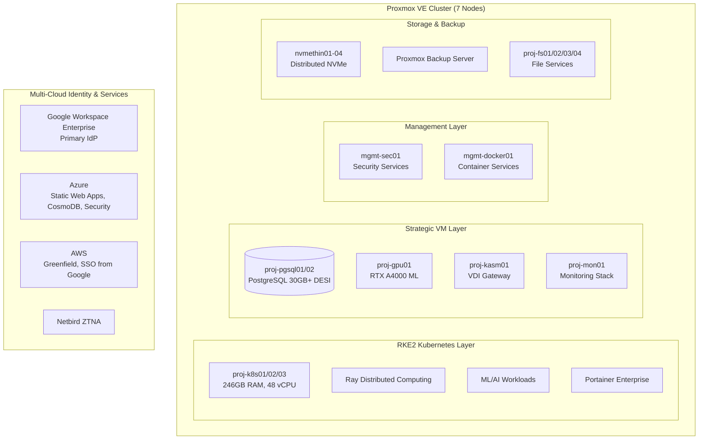

<!--
---
title: "Proxmox Astronomy Lab"
description: "Scientific computing platform for astronomical research on a 6-node Proxmox cluster"
author: "VintageDon"
date: "2026-04-25"
version: "3.1"
status: "Stale - Pending Rewrite"
note: "This README contains stale content from earlier architectural visions (RKE2, 7 nodes, enterprise framing). See AGENTS.md for current repository context and infrastructure state."
tags:
  - type: project-root
  - domain: [infrastructure, astronomy, research-computing]
  - tech: [proxmox, postgresql, ansible, docker, ollama]
related_documents:
  - "[RadioAstronomy.io Organization](https://github.com/radioastronomyio)"
  - "[Ethops](https://github.com/vintagedon/ethops)"
  - "[Agent Crate](https://github.com/vintagedon/agent-crate)"
  - "[NIST AI RMF Cookbook](https://github.com/vintagedon/nist-ai-rmf-cookbook)"
---
-->

# 🌌 Proxmox Astronomy Lab


[](https://www.proxmox.com/)
[](https://docs.rke2.io/)
[](https://www.postgresql.org/)
[](https://www.cisecurity.org/controls)
[](LICENSE)

> Enterprise-grade astronomical computing platform enabling DESI research through hybrid Kubernetes/VM infrastructure.

This repository documents the Proxmox Astronomy Lab — a 7-node production cluster running hybrid RKE2 Kubernetes and strategic VMs for astronomical data science. We produce enhanced datasets and original research from public surveys, operating at organizational scale with enterprise infrastructure standards.

---

## 🔭 Background

This section provides context for the platform's purpose and design. If you're familiar with hybrid Proxmox/Kubernetes infrastructure, skip to [Quick Start](#-quick-start).


The Proxmox Astronomy Lab serves as the compute foundation for [RadioAstronomy.io](https://github.com/radioastronomyio) research projects. The platform combines virtualization flexibility with container orchestration — VMs for persistent services (databases, file servers, GPU workloads) and Kubernetes for dynamic ML/AI pipelines.

Our primary workload is [DESI](https://www.desi.lbl.gov/) (Dark Energy Spectroscopic Instrument) data analysis, processing tens of gigabytes of galaxy catalogs and spectral data. The infrastructure enables reproducible research at scale: PostgreSQL with pgvector for catalog queries, distributed Ray clusters for ML training, and GPU acceleration for model inference.

AI is embedded in 100% of our workflows, governed by a formal [NIST AI RMF](https://github.com/vintagedon/nist-ai-rmf-cookbook) implementation with model cards, risk scenarios, and multi-framework compliance mapping. We target CISv8 L1 as an achievable security baseline appropriate for a research platform.

---

## 🎯 Target Audience

| Audience | Use Case |
|----------|----------|
| Researchers | Access compute resources for DESI analysis projects |
| Infrastructure Engineers | Deploy similar hybrid clusters, learn Proxmox/RKE2 patterns |
| Data Scientists | Understand ML infrastructure, GPU pipelines, database architecture |
| DevOps/SRE | Review automation patterns, monitoring stack, security implementation |
| AI Governance Practitioners | See production AI policy framework in action |

---

## 🏗️ Architecture

The platform uses a hybrid architecture: RKE2 Kubernetes for dynamic workloads, strategic VMs for persistent services, multi-cloud identity and hosting.

### Infrastructure Diagram



### Multi-Cloud Architecture

| Cloud | Role | Active Services |
|-------|------|-----------------|
| Google Workspace Enterprise | Primary IdP, daily operations | Mail, Docs, SSO, Chrome Enterprise, DLP, Gemini integration |
| Azure | Platform services + security backbone | Static Web Apps, CosmoDB, SharePoint, Business Premium + Intune Suite |
| AWS | Greenfield expansion | IAM Identity Center (SSO from Google), breakglass users configured |

### Service Architecture

| Service Tier | Implementation | Components |
|--------------|----------------|------------|
| Identity | Google Workspace Enterprise + Netbird ZTNA | SSO, conditional access, MFA, zero-trust remote access |
| Orchestration | RKE2 + Portainer | 3-node Kubernetes control plane, container management |
| Compute | Hybrid K8s/VM | Dynamic scaling + persistent services across 35+ VMs |
| Data | PostgreSQL + File Services | 30GB+ DESI databases + distributed file systems |
| AI/ML | Ray + GPU acceleration | Distributed computing + RTX A4000 inference |
| Monitoring | Prometheus + Grafana + Loki | Centralized observability |
| Security | CISv8 L1 + CIS-RAM + NIST-AI-RMF | Infrastructure hardening, AI governance |


---

## 📊 Project Status

The platform is in production, supporting active research workloads.

| Area | Status | Description |
|------|--------|-------------|
| Core Infrastructure | ✅ Production | 7-node cluster, networking, storage |
| RKE2 Kubernetes | ✅ Production | 3-node cluster + GPU worker |
| Database Services | ✅ Production | PostgreSQL 16 with pgvector, PostGIS |
| Monitoring Stack | ✅ Production | Prometheus, Grafana, Loki |
| AI Governance | ✅ Production | NIST AI RMF framework, 8 model cards, 10 risk scenarios |
| Security Baseline | 🔄 In Progress | CISv8 L1 implementation |
| Documentation | 🔄 In Progress | Phase 1 migration to new standards |

---

## 🔧 Platform Specifications

### Cluster Summary

| Resource | Value |
|----------|-------|
| Nodes | 7 |
| Total Cores | 144 |
| Total RAM | 768 GB |
| Total NVMe | 24 TB |
| Network Fabric | LACP 2.5G/10G per node |
| GPU | 2× RTX A4000 16GB |
| Production VMs | 35+ |

### Node Inventory

| Node | CPU | Cores | RAM | Role |
|------|-----|-------|-----|------|
| node01 | i9-12900H | 20 | 96 GB | Compute (K8s) |
| node02 | i5-12600H | 16 | 96 GB | Light compute + storage |
| node03 | i9-12900H | 20 | 96 GB | Compute (K8s) |
| node04 | i9-12900H | 20 | 96 GB | Compute (K8s) |
| node05 | i5-12600H | 16 | 96 GB | Light compute + storage |
| node06 | i9-13900H | 20 | 96 GB | Heavy compute (databases) |
| node07 | AMD 5950X | 32 | 128 GB | GPU compute |

---

## 🤖 AI Governance

AI is embedded throughout our workflows with formal governance based on the [NIST AI Risk Management Framework](https://www.nist.gov/itl/ai-risk-management-framework). Our complete policy framework is published in the [NIST AI RMF Cookbook](https://github.com/vintagedon/nist-ai-rmf-cookbook).

### Governance Framework

| Component | Count | Description |
|-----------|-------|-------------|
| Core Policies | 3 | AI governance, acceptable use, model registry |
| Technical Standards | 3 | Risk assessment, secure AI systems, transparency |
| Risk Scenarios | 10 | R01-R10 covering data egress, prompt injection, drift, etc. |
| Model Cards | 8 | Claude Sonnet 4.5, Opus 4.2, Gemini Pro 2.5, and others |

### Compliance Alignment

| Framework | Scope |
|-----------|-------|
| NIST AI RMF | Full Govern/Map/Measure/Manage implementation |
| ISO/IEC 42001 | AI management system alignment |
| CIS Controls v8 L1 | Security baseline (in progress) |
| CIS-RAM | Risk assessment methodology |
| Colorado SB24-205 | AI disclosure and duty-of-care |

---

## 🔬 Active Research

Current DESI Data Release 1 analysis projects. See [RadioAstronomy.io](https://github.com/radioastronomyio) for full project details.

| Project | Focus | Status |
|---------|-------|--------|
| [Cosmic Void Galaxies](https://github.com/radioastronomyio/desi-cosmic-void-galaxies) | Environmental quenching, ARD factory | Active |
| [QSO Anomaly Detection](https://github.com/radioastronomyio/desi-qso-anomaly-detection) | ML outlier detection on 1.6M spectra | Planned |
| [Quasar Outflows](https://github.com/radioastronomyio/desi-quasar-outflows) | AGN feedback energetics | Planned |
| [RBH-1 Reanalysis](https://github.com/radioastronomyio/rbh1-validation-reanalysis) | Hypervelocity SMBH validation | Active |

---

## 📁 Repository Structure

```markdown
PROXMOX-ASTRONOMY-LAB/
├── 🤖 ai-and-machine-learning/      # AI/ML infrastructure, GPU computing, RAG systems
├── 🛠️ applications-and-services/    # Production service configurations
├── 🌌 astronomy-projects/           # DESI research projects and workflows
├── 🔧 automation-and-orchestration/ # Ansible automation, infrastructure as code
├── 📚 docs/                         # Documentation standards and procedures
├── 🔩 hardware/                     # Cluster specifications, network architecture
├── 🏗️ infrastructure/               # Core platform services, hybrid architecture
├── 📋 policies-and-procedures/      # Enterprise governance, compliance
├── 📊 project-management/           # Project coordination and planning
├── 📄 publishing/                   # Scientific publication workflows
├── 🔒 security-assurance/           # CIS Controls v8 L1 implementation
└── 📖 wiki/                         # Operational procedures and guides
```

---

## 🤝 OSS Program Support

This organization benefits from open source programs that provide tooling to qualifying public repositories.

### Active Programs

| Program | Provides | Use Case |
|---------|----------|----------|
| [CodeRabbit](https://coderabbit.ai) | AI code review (Pro tier) | PR review, CLI integration |
| [Atlassian](https://www.atlassian.com/software/views/open-source-license-request) | Jira, Confluence (Standard) | Project tracking, documentation |

### Available for Future Use

| Program | Provides | Planned Use |
|---------|----------|-------------|
| [Snyk](https://snyk.io/plans/) | Security scanning | Dependency vulnerability detection |
| [SonarCloud](https://www.sonarsource.com/open-source-editions/) | Code quality | Static analysis |
| [Sentry](https://sentry.io/for/open-source/) | Error tracking | Runtime monitoring |
| [Datadog](https://www.datadoghq.com/partner/open-source/) | Observability | Metrics, logs, APM |

---

## 🚀 Getting Started

### For Researchers

1. Review [Astronomy Projects](astronomy-projects/README.md) for active research and datasets
2. Understand [Infrastructure Overview](infrastructure/README.md) for compute capabilities
3. Explore [Publishing Workflows](publishing/README.md) for data release procedures

### For Infrastructure Engineers

1. Study [Hardware Architecture](hardware/README.md) for cluster specifications
2. Examine [Security Framework](security-assurance/README.md) for CIS Controls implementation
3. Deploy using [Infrastructure as Code](automation-and-orchestration/README.md) patterns

### For Data Scientists

1. Explore [AI/ML Infrastructure](ai-and-machine-learning/README.md) for GPU and distributed computing
2. Review [Application Services](applications-and-services/README.md) for databases and ML platforms
3. Learn [Kubernetes Platform](infrastructure/README.md) for container orchestration

### For AI Governance

1. Review [NIST AI RMF Cookbook](https://github.com/vintagedon/nist-ai-rmf-cookbook) for policy framework
2. Examine model cards and risk scenarios for implementation patterns
3. See compliance mapping for multi-framework alignment

---

## 📄 License

This project is licensed under the MIT License — see [LICENSE](LICENSE) for details.

---

## 🙏 Acknowledgments

- [Proxmox](https://www.proxmox.com/) — Virtualization platform
- [Rancher/SUSE](https://docs.rke2.io/) — RKE2 Kubernetes distribution
- [DESI Collaboration](https://www.desi.lbl.gov/) — Public data access
- [NIST](https://www.nist.gov/) — AI Risk Management Framework
- Open source community — Tools and libraries that make this possible

---

Last Updated: January 2, 2026 | Platform Status: Production